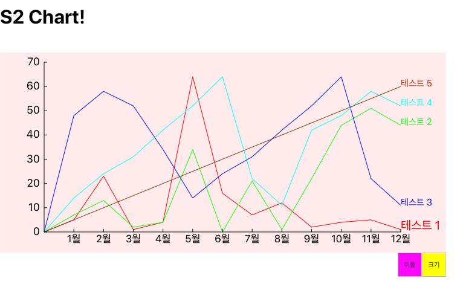
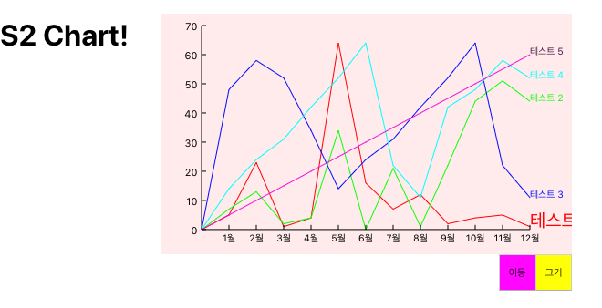

# S2 Chart
React를 이용해 만든 차트예제입니다.

본 repository는 학습용입니다.

## 기본이미지


## 이동 및 크기 조절



# 사용법
```html
<S2Chart
  graphData={graphData}
  width='50%'
  height='400'
  />
```
### 데이터 포멧
```javascript
const graphData = {
    background : '#ffeeee',
    axisX : {
      fontSize : 'auto', //or number -> fontSize : 15
      tags : ["1월", "2월", "3월", "4월", "5월", "6월",
        "7월", "8월", "9월", "10월", "11월", "12월"]
    },
    axisY : {
      fontSize : 'auto',
      min : 0,
      max : 70,
      divide : 7
    },
    dataList : [
      {
        name : "테스트 1",
        values : [0,5,23,1,4,64,16,7,12,2,4,5,1],
        color : "#ff0000",
        fontSize : 20
      },
      {
        name : "테스트 2",
        values : [0,7,13,2,4,34,0,21,1,22,44,51,44],
        color : "#00ff00",
        fontSize : 'auto'
      },
      {
        name : "테스트 3",
        values : [0,48,58,52,34,14,24,31,42,52,64,22,11],
        color : "#0000ff",
        fontSize : 'auto'
      },
      {
        name : "테스트 4",
        values : [0,14,24,31,42,52,64,22,11,42,48,58,52],
        color : "#00ffff",
        fontSize : 'auto'
      },
      {
        name : "테스트 5",
        values : [0,5,10,15,20,25,30,35,40,45,50,55,60],
        fontSize : 'auto'
      }
    ],
    control : {
      movable : {
        defaultX : 0,
        defaultY : 100
      }, //or movable : true
      resizable : true
    }
};
```
